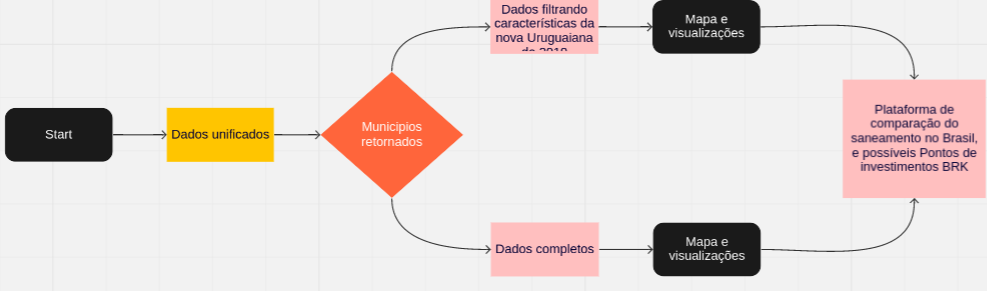
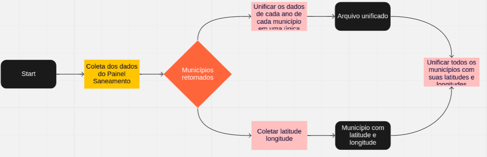

<h1 style='text-align: center; color:blue; '>Datathon BRK</h1>

### A aplicacao do Datathon BRK foi hospedada no seguinte [link](https://datathon-brk-time05.herokuapp.com/)

- Ideia Chave: Criar um sistema de análise simplificado, onde seja possível encontrar um município em 2019 com as características de Uruguaiana em 2010, além de uma comparação de evolução de indicadores e de dados diretamente.

<h2 style='text-align: center;'>Pipeline da ideia</h1>

<h2 style='text-align: center;'>Pipeline do processo de extração dos dados</h1>

